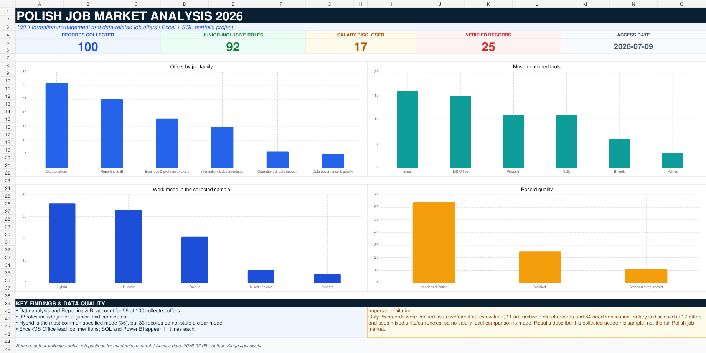

# Polish Job Market Analysis 2026

**Author:** Kinga Jaszewska  
**Tools:** Excel, SQL, Python, pandas, SQLite  
**Project type:** Data cleaning, exploratory analysis and dashboarding

This project analyses a sample of 100 Polish job offers related to information management, data analysis, reporting, business analysis and data support. It turns an academic research workbook into a reproducible portfolio project with cleaned data, SQL queries and an interactive Excel dashboard.



## Questions addressed

1. Which job families are most common in the collected sample?
2. How accessible are these roles to junior candidates?
3. Which work modes and employment types appear most often?
4. Which analytical tools are explicitly mentioned?
5. How complete and reliable are the collected records?

## Dataset

- 100 job-offer records
- 10 recruitment portals
- common access date: **2026-07-09**
- source: public job postings collected by the author for academic research

The dataset is a purposive academic sample, not a representative census of the Polish labour market. Portal coverage is uneven: Pracuj.pl accounts for 66 records.

## Key findings

- **56%** of records belong to Data analysis or Reporting & BI.
- **92%** are classified as Junior / entry or Junior–Mid.
- Hybrid work is the most common specified mode (**36 records**), but work mode is unknown in **33 records**.
- Excel (**16 mentions**) and MS Office (**15**) are the most frequently stated tools; Power BI and SQL appear **11 times each**.
- Salary information is disclosed in only **17 records**.
- Record review produced **25 verified records**, **11 archived direct records** and **64 records needing verification**.

Salary values were not compared because the source mixes currencies, gross/net values and different time units.

## Data quality

The project explicitly separates:

- **Verified** — direct or sufficiently specific active record;
- **Archived direct record** — a direct listing exists but is archived or closed;
- **Needs verification** — search page, generic URL, incomplete source or status requiring manual confirmation.

Additional flags identify repeated source URLs and repeated title–company combinations. This prevents the analysis from presenting all 100 rows as current, independently verified vacancies.

## Workflow

1. Preserve the original academic workbook in `data/raw/`.
2. Clean and standardise job family, seniority, work mode and employment type with Python.
3. Extract tool mentions into a separate one-to-many table.
4. Load the processed data into SQLite.
5. Analyse the sample with documented SQL queries.
6. Present formula-backed metrics and charts in Excel.

## Project structure

```text
job-market-data-analysis-2026/
├── data/
│   ├── raw/job_offers_source.xlsx
│   └── processed/
│       ├── job_offers_clean.csv
│       ├── offer_tools.csv
│       ├── data_dictionary.csv
│       ├── validation_summary.json
│       └── job_market.db
├── excel/Polish_Job_Market_Analysis_2026.xlsx
├── reports/figures/dashboard_preview.png
├── scripts/
│   ├── prepare_data.py
│   └── build_database.py
├── sql/
│   ├── schema.sql
│   └── analysis_queries.sql
├── requirements.txt
└── README.md
```

## Reproduce the project

```bash
python -m pip install -r requirements.txt
python scripts/prepare_data.py
python scripts/build_database.py
```

Open `data/processed/job_market.db` in any SQLite client and run the queries from `sql/analysis_queries.sql`. Open `excel/Polish_Job_Market_Analysis_2026.xlsx` to explore the dashboard and supporting sheets.

## Limitations

- The sample was selected for academic research and does not represent the full labour market.
- Listings may have changed since the collection date.
- A large share of records requires manual source verification.
- Tool counts include only explicit mentions captured in the source text.
- Salary disclosure is analysed, but salary levels are not compared.

## Licence

The project code and documentation are available under the MIT License. The job-offer information remains attributable to its original public sources.
